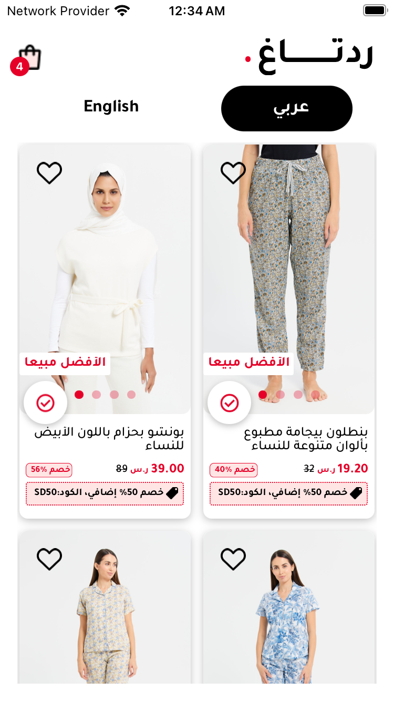
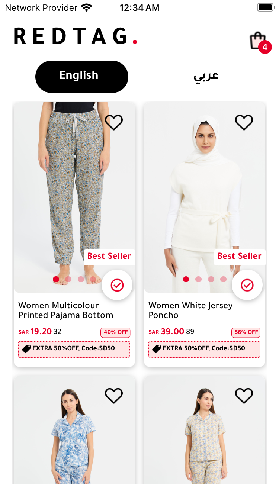

# RedTag

⚛️ RedTag is a e-commerce platform designed assignment. Whether you are browsing products, adding items to your cart. With its single component architecture, the app delivers robust performance and responsiveness across various devices, including small screens and tablets.

## 📱 Screenshot

  

  
  
  

### Video Preview of RedTag Appp

https://github.com/gulsher7/redtag_assignment/assets/56266123/436b38fc-e835-4e21-b5ab-2e0e146beb02

# Key Features

- **Localization**: Supports English and Arabic translations, enabling users to switch languages. It detects the phone's language upon first launch and opens in Arabic if the phone's language is set to Arabic. After the initial launch, if the user manually changes the language, the app will always open in the selected language.

- **Fully Responsive Design**: Tested on small screens and tablets to ensure a consistent user experience across devices.
- **Animations**: Add animation for selecting the language, rendering the FlatList item, and adding items to the cart.
- **AsyncStorage And UseContext API**: If the user kills the app and opens it again, it will show the selected language and the items in the cart.
- **Image Caching**: Cache the remote image URL so the image loads faster next time..

## Libraries Using for RedTag Assignment 📚

<table>
<tr>
<td>

- [react-native-reanimated](https://www.npmjs.com/package/react-native-reanimated)
- [react-native-safe-area-context](https://www.npmjs.com/package/react-native-safe-area-context)
- [expo-splash-screen](https://www.npmjs.com/package/expo-splash-screen)
- [expo-image](https://www.npmjs.com/package/expo-image)
- [expo-font](https://www.npmjs.com/package/expo-font)
- [axios](https://www.npmjs.com/package/axios)

</td>

<td>

- [i18next](https://www.npmjs.com/package/i18next)
- [@os-team/i18next-react-native-language-detector](https://www.npmjs.com/package/@os-team/i18next-react-native-language-detector)
- [intl-pluralrules](https://www.npmjs.com/package/intl-pluralrules)
- [react-i18next](https://www.npmjs.com/package/react-i18next)
- [@react-native-async-storage/async-storage](https://www.npmjs.com/package/@react-native-async-storage/async-storage)

</td>
</tr>
</table>
